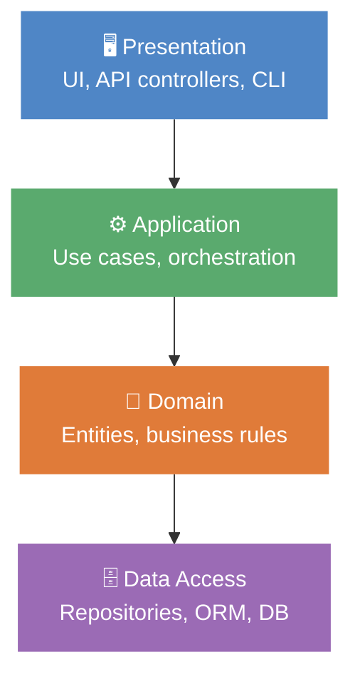

# Software Architecture

Architecture defines the structure of a system, the boundaries between responsibilities, and the rules that allow the project to evolve without breaking everything.

## Why good architecture?

### Scalability

- Ability to handle growth
- Adding features without breaking everything
- Sustained performance

### Maintainability

- Simpler code to understand
- Localized changes
- Easier tests to write

### Flexibility

- Adaptation to change
- Component reuse
- Easier technology evolution

## Useful principles

### Separation of Concerns

Separating responsibilities helps reduce coupling and makes each part more testable.

### Dependency Inversion

Business rules should depend on abstractions, not on concretions.

### Hexagonal Architecture vs Clean Architecture

- Clean Architecture generalizes hexagonal architecture
- Hexagonal isolates the business domain via ports and adapters
- Clean Architecture adds a stricter organization in internal layers

<Callout type="info">
  If the need is simple or the team is primarily focused on shipping fast, hexagonal architecture is often lighter to apply.
  If the context is more demanding and a stricter separation is needed, Clean Architecture provides an additional level of rigor.
</Callout>

## Architecture styles

### Main styles

1. Monolithic
2. Layered
3. Hexagonal
4. Microservices
5. Serverless
6. Event-driven

### Layered model

Each layer only depends on the layer immediately below — never upward.

## Tests and architecture

- Black-box tests validate external behavior
- White-box tests verify internal logic and execution paths
- Both approaches are complementary

## Independence of good architecture

1. Independent of frameworks
2. Testable without UI, DB, or web server
3. Independent of the UI
4. Independent of the database
5. Independent of external systems

## Ideas to keep in mind

- Architecture should serve the business, not technical trends
- Boundaries must be explicit
- Dependencies toward the outside should remain at the edges of the system
