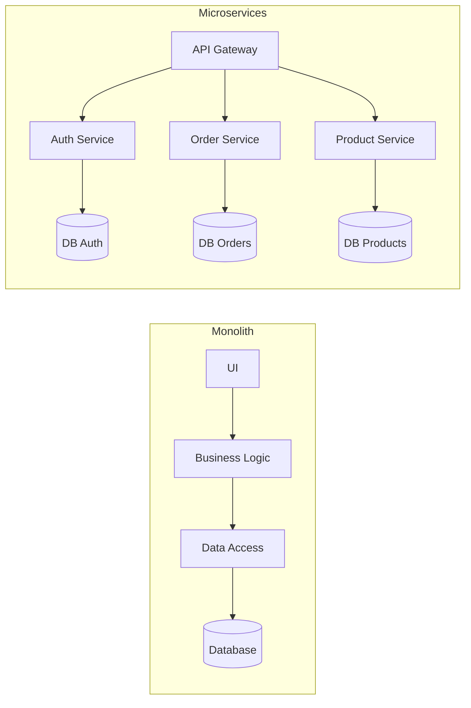

# System Design

_System design is about choosing an architecture capable of handling load, evolving over time, and remaining operable._

## Fundamentals

- What happens when you type a URL in the browser
- DNS, Load Balancer and CDN
- TCP vs UDP
- HTTP vs HTTPS

## Data and storage

- SQL vs NoSQL
- Indexing
- Replication
- Sharding
- When to choose MongoDB or PostgreSQL

## Scaling techniques

- Horizontal scaling
- Vertical scaling
- Cache with Redis or Memcached
- Load balancing: round-robin, IP hashing

## Architecture patterns

- Monolith vs microservices

- Event-driven architecture
- Pub/Sub
- Message queues like Kafka or RabbitMQ

## Framing ideas

- Storage choice should follow the real need, not hype
- Scalability has an operational cost
- A distributed architecture adds complexity everywhere
