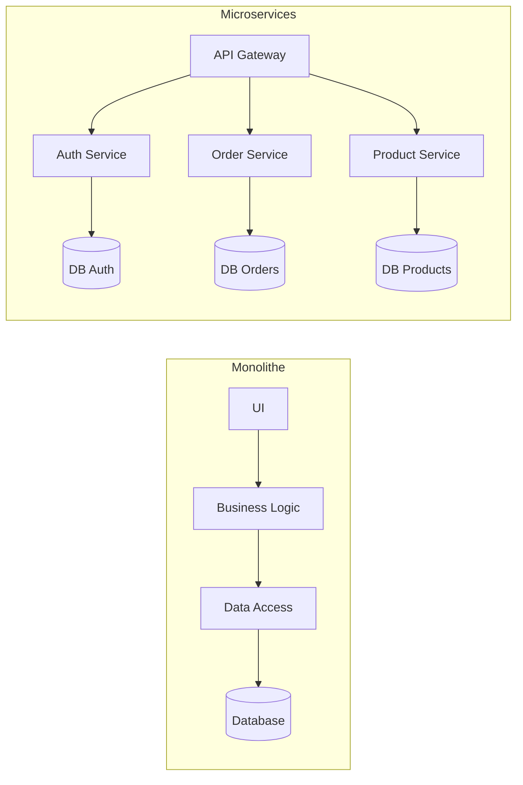

# System Design

_Le system design consiste à choisir une architecture capable de tenir la charge, d'évoluer et de rester exploitable._

## Bases

- Ce qui se passe quand on tape une URL dans le navigateur
- DNS, Load Balancer et CDN
- TCP vs UDP
- HTTP vs HTTPS

## Données et stockage

- SQL vs NoSQL
- Indexing
- Replication
- Sharding
- Quand choisir MongoDB ou PostgreSQL

## Scaling techniques

- Horizontal scaling
- Vertical scaling
- Cache avec Redis ou Memcached
- Load balancing: round-robin, IP hashing

## Architecture patterns

- Monolithe vs microservices

- Event-driven architecture
- Pub/Sub
- Message queues comme Kafka ou RabbitMQ

## Idées de cadrage

- Le choix de stockage doit suivre le besoin réel, pas l'effet de mode
- La scalabilité a un coût opérationnel
- Une architecture distribuée ajoute de la complexité partout
