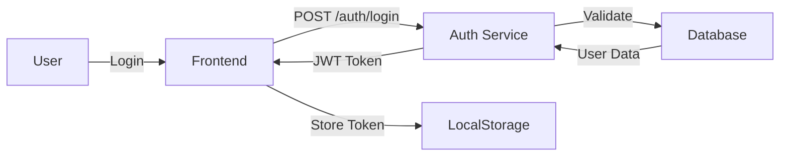

import { Meta } from "@storybook/addon-docs/blocks";

<Meta title="Guide du bon developpeur/Documentation" />

# 📖 Documentation

Une bonne documentation est essentielle pour la maintenabilité et l'adoption de votre code.

## 🎯 Pourquoi documenter ?

### Pour les autres

- Facilite l'onboarding des nouveaux développeurs
- Permet aux autres de comprendre et utiliser votre code
- Réduit le besoin de support

### Pour vous

- Vous oublierez comment votre code fonctionne
- "Future you" vous remerciera
- Force à clarifier vos idées

### Pour le projet

- Réduit la dépendance aux individus
- Facilite la maintenance
- Améliore la qualité globale

## 📝 Types de documentation

### 1. README.md

Le fichier le plus important de votre projet.

```markdown
# Nom du projet

Brève description (1-2 phrases)

## 🚀 Installation

\`\`\`bash
npm install
npm start
\`\`\`

## 📖 Utilisation

\`\`\`javascript
import { MyLib } from 'my-lib';

const result = MyLib.doSomething();
\`\`\`

## 🎯 Fonctionnalités

- Feature 1
- Feature 2
- Feature 3

## 🛠️ Configuration

\`\`\`bash

# .env

API_KEY=your_key_here
DATABASE_URL=postgres://...
\`\`\`

## 🧪 Tests

\`\`\`bash
npm test
npm run test:coverage
\`\`\`

## 🤝 Contribution

Voir [CONTRIBUTING.md](CONTRIBUTING.md)

## 📄 Licence

MIT
```

### 2. Documentation API

#### Code-first (JSDoc)

```javascript
/**
 * Récupère un utilisateur par son ID
 *
 * @param {number} userId - L'ID de l'utilisateur
 * @returns {Promise<User>} L'utilisateur trouvé
 * @throws {NotFoundError} Si l'utilisateur n'existe pas
 *
 * @example
 * const user = await getUserById(123);
 * console.log(user.name);
 */
async function getUserById(userId) {
  const user = await db.findUser(userId);
  if (!user) {
    throw new NotFoundError(`User ${userId} not found`);
  }
  return user;
}

/**
 * Configuration de l'application
 * @typedef {Object} AppConfig
 * @property {string} apiUrl - URL de l'API
 * @property {number} timeout - Timeout en ms
 * @property {boolean} debug - Mode debug activé
 */

/**
 * Classe représentant un utilisateur
 */
class User {
  /**
   * Crée un utilisateur
   * @param {string} name - Nom de l'utilisateur
   * @param {string} email - Email de l'utilisateur
   */
  constructor(name, email) {
    this.name = name;
    this.email = email;
  }

  /**
   * Vérifie si l'email est valide
   * @returns {boolean} true si valide
   */
  hasValidEmail() {
    return this.email.includes("@");
  }
}
```

#### TypeScript (Types auto-documentés)

```typescript
/**
 * Récupère un utilisateur par son ID
 */
async function getUserById(userId: number): Promise<User> {
  const user = await db.findUser(userId);
  if (!user) {
    throw new NotFoundError(`User ${userId} not found`);
  }
  return user;
}

interface User {
  /** Identifiant unique */
  id: number;

  /** Nom complet de l'utilisateur */
  name: string;

  /** Adresse email */
  email: string;

  /** Date de création */
  createdAt: Date;

  /** Rôle de l'utilisateur */
  role: "admin" | "user" | "guest";
}

type AppConfig = {
  /** URL de l'API backend */
  apiUrl: string;

  /** Timeout des requêtes (en ms) */
  timeout: number;

  /** Active les logs de debug */
  debug?: boolean;
};
```

#### OpenAPI/Swagger (API REST)

```yaml
openapi: 3.0.0
info:
  title: User API
  version: 1.0.0
  description: API de gestion des utilisateurs

paths:
  /users/{userId}:
    get:
      summary: Récupère un utilisateur
      description: Retourne un utilisateur par son ID
      parameters:
        - name: userId
          in: path
          required: true
          schema:
            type: integer
          description: ID de l'utilisateur
      responses:
        "200":
          description: Utilisateur trouvé
          content:
            application/json:
              schema:
                $ref: "#/components/schemas/User"
        "404":
          description: Utilisateur non trouvé

components:
  schemas:
    User:
      type: object
      properties:
        id:
          type: integer
          example: 123
        name:
          type: string
          example: "John Doe"
        email:
          type: string
          format: email
          example: "john@example.com"
```

### 3. Commentaires de code

#### Quand commenter ?

```javascript
✅ Bon - Explique le "pourquoi"

// On utilise setTimeout au lieu de setInterval car on veut
// attendre la fin de la requête avant d'en lancer une nouvelle
setTimeout(() => fetchData(), INTERVAL);

// Workaround pour un bug dans IE11 qui ne supporte pas Promise.finally
if (!Promise.prototype.finally) {
  Promise.prototype.finally = function(callback) {
    // ...
  };
}

// L'algorithme de Luhn pour valider les numéros de carte bancaire
function validateCardNumber(number) {
  // ...
}
```

```javascript
❌ Mauvais - Redondant

// Incrémente i
i++;

// Retourne le nom de l'utilisateur
function getUserName() {
  return user.name;
}

// Boucle sur les utilisateurs
users.forEach(user => {
  // ...
});
```

#### Comment bien commenter ?

```javascript
// ✅ Commentaires utiles

/**
 * IMPORTANT: Cette fonction doit être appelée après initDatabase()
 * sinon elle échouera silencieusement
 */
async function migrateData() {}

/**
 * Performance: Cette opération est coûteuse (O(n²)).
 * Considérer optimiser si n > 1000
 */
function findDuplicates(array) {}

/**
 * HACK: Temporaire jusqu'à ce que l'API backend soit fixée
 * TODO: Supprimer quand API v2 sera déployée
 * @see https://github.com/project/issues/123
 */
const TEMP_FALLBACK = "default";

/**
 * SECURITY: Validation stricte nécessaire car données
 * proviennent directement de l'input utilisateur
 */
function sanitizeInput(input) {}
```

### 4. Architecture Decision Records (ADR)

Documenter les décisions importantes.

```markdown
# ADR-001: Utilisation de PostgreSQL

## Status

Accepté

## Contexte

Nous devons choisir une base de données pour notre application.

Besoins:

- Relations complexes entre entités
- Transactions ACID
- Support JSON pour certaines données flexibles
- Open source

## Décision

Nous utiliserons PostgreSQL.

## Conséquences

### Positives

- Excellent support des relations et contraintes
- Très performant pour nos besoins
- Extensible (PostGIS pour geo-spatial, etc.)
- Large communauté

### Négatives

- Courbe d'apprentissage pour l'équipe
- Scale vertical (pas horizontal)
- Maintenance plus complexe que NoSQL simple

## Alternatives considérées

### MySQL

- Moins de fonctionnalités avancées
- Support JSON limité

### MongoDB

- Pas adapté pour nos relations complexes
- Pas de transactions multi-documents à l'époque

## Références

- https://www.postgresql.org/about/
- Performance benchmark: [link]
```

### 5. Guides et Tutoriels

```markdown
# Guide: Ajouter un nouveau endpoint

## Prérequis

- Node.js 18+
- PostgreSQL installé
- Variables d'environnement configurées

## Étapes

### 1. Créer le modèle

\`\`\`javascript
// src/models/Post.js
export class Post {
constructor(data) {
this.id = data.id;
this.title = data.title;
this.content = data.content;
}
}
\`\`\`

### 2. Créer le repository

\`\`\`javascript
// src/repositories/PostRepository.js
export class PostRepository {
async findById(id) {
// Implementation
}
}
\`\`\`

### 3. Créer le service

\`\`\`javascript
// src/services/PostService.js
export class PostService {
constructor(postRepository) {
this.repo = postRepository;
}

async getPost(id) {
return this.repo.findById(id);
}
}
\`\`\`

### 4. Créer le controller

\`\`\`javascript
// src/controllers/PostController.js
export async function getPost(req, res) {
const post = await postService.getPost(req.params.id);
res.json(post);
}
\`\`\`

### 5. Ajouter la route

\`\`\`javascript
// src/routes/posts.js
router.get('/posts/:id', getPost);
\`\`\`

### 6. Ajouter les tests

\`\`\`javascript
// src/controllers/PostController.test.js
describe('getPost', () => {
test('returns post when found', async () => {
// ...
});
});
\`\`\`

## Vérification

\`\`\`bash
npm test
curl http://localhost:3000/posts/1
\`\`\`
```

## 📊 Diagrammes

### Architecture

```
┌────────────────┐
│   Frontend     │
│   (React)      │
└───────┬────────┘
        │ HTTP
        ↓
┌────────────────┐
│  API Gateway   │
└───────┬────────┘
        │
   ┌────┴────┐
   ↓         ↓
┌─────┐   ┌─────┐
│Auth │   │Posts│
│ API │   │ API │
└──┬──┘   └──┬──┘
   │         │
   └────┬────┘
        ↓
    ┌────────┐
    │Database│
    └────────┘
```

### Flux de données



## ✅ Bonnes pratiques

### 1. Gardez la documentation à jour

```markdown
❌ Documentation obsolète pire que pas de documentation

✅ Workflow:

1. Modifiez le code
2. Mettez à jour la documentation
3. Revoyez la documentation en code review
```

### 2. Documentation proche du code

```markdown
✅ Documentation à côté du code
src/
features/
auth/
README.md ← Documentation de la feature
components/
services/

❌ Documentation séparée qui devient obsolète
docs/
all-features.md ← Loin du code
```

### 3. Exemples concrets

```javascript
❌ Documentation abstraite
/**
 * Traite les données
 * @param data Les données
 * @returns Le résultat
 */
function process(data) { }

✅ Documentation avec exemples
/**
 * Convertit un tableau d'utilisateurs en Map indexée par ID
 *
 * @param {User[]} users - Tableau d'utilisateurs
 * @returns {Map<number, User>} Map indexée par user.id
 *
 * @example
 * const users = [
 *   { id: 1, name: 'Alice' },
 *   { id: 2, name: 'Bob' }
 * ];
 * const userMap = indexUsersById(users);
 * // Map { 1 => { id: 1, name: 'Alice' }, 2 => {...} }
 */
function indexUsersById(users) {
  return new Map(users.map(u => [u.id, u]));
}
```

### 4. Documentation progressive

```markdown
Niveau 1: README minimal (Installation + Usage basique)
Niveau 2: API documentation (Fonctions, paramètres)
Niveau 3: Guides et tutoriels (Comment faire X)
Niveau 4: Architecture et ADRs (Pourquoi on a fait ça)
Niveau 5: Contribution guidelines (Comment contribuer)
```

### 5. Documentation testable

```javascript
// Les exemples dans la doc doivent être testés

/**
 * Additionne deux nombres
 * @example
 * add(2, 3) // returns 5
 */
function add(a, b) {
  return a + b;
}

// Test extrait de la documentation
test("add example from docs", () => {
  expect(add(2, 3)).toBe(5);
});
```

## 🛠️ Outils de documentation

### Générateurs de documentation

```bash
# JSDoc - JavaScript
npm install -D jsdoc
jsdoc src -r -d docs

# TypeDoc - TypeScript
npm install -D typedoc
typedoc src

# Sphinx - Python
pip install sphinx
sphinx-quickstart

# Javadoc - Java
javadoc -d docs src/**/*.java

# Doxygen - C/C++
doxygen Doxyfile
```

### Documentation sites

```bash
# Docusaurus - React
npx create-docusaurus@latest my-docs classic

# VitePress - Vue
npx create-vitepress
npm run docs:dev

# MkDocs - Python
pip install mkdocs
mkdocs new my-docs
mkdocs serve

# GitBook
npx gitbook-cli install
gitbook serve
```

### Diagrammes

````bash
# Mermaid - Diagrammes en Markdown
```mermaid
sequenceDiagram
    User->>Frontend: Click login
    Frontend->>API: POST /auth/login
    API->>DB: Validate credentials
    DB-->>API: User data
    API-->>Frontend: JWT token
````

# PlantUML - UML diagrams

@startuml
User -> Frontend: login()
Frontend -> API: POST /auth/login
API -> DB: validateUser()
@enduml

# Draw.io / Excalidraw - Diagrammes visuels

````

## 📚 Templates utiles

### CONTRIBUTING.md

```markdown
# Comment contribuer

## Prérequis
- Node.js 18+
- Git

## Setup local
\`\`\`bash
git clone ...
npm install
npm test
\`\`\`

## Workflow
1. Fork le projet
2. Créer une branche (`git checkout -b feature/amazing`)
3. Commit vos changements (`git commit -m 'feat: add amazing'`)
4. Push (`git push origin feature/amazing`)
5. Ouvrir une Pull Request

## Standards
- Tests pour toute nouvelle feature
- Code formaté avec Prettier
- Commits conventionnels
- Code review obligatoire

## Questions ?
Ouvrir une issue ou contactez-nous sur Discord
````

### CHANGELOG.md

```markdown
# Changelog

## [1.2.0] - 2024-03-05

### Added

- Nouveau système d'authentification #123
- Support du dark mode #145

### Changed

- Amélioration des performances de 50% #134
- Migration vers React 18 #156

### Fixed

- Correction du bug de login #142
- Fix memory leak dans useEffect #149

### Deprecated

- L'ancienne API sera supprimée en v2.0

## [1.1.0] - 2024-02-15

...
```

## 📚 Ressources

- [Write the Docs](https://www.writethedocs.org/)
- [Documentation Guide](https://www.divio.com/blog/documentation/)
- [JSDoc](https://jsdoc.app/)
- [TypeDoc](https://typedoc.org/)
- [Swagger/OpenAPI](https://swagger.io/)

---

> _"Code tells you how, comments tell you why."_ - Jeff Atwood
