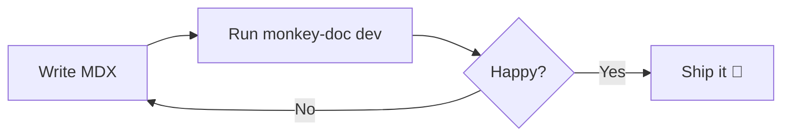
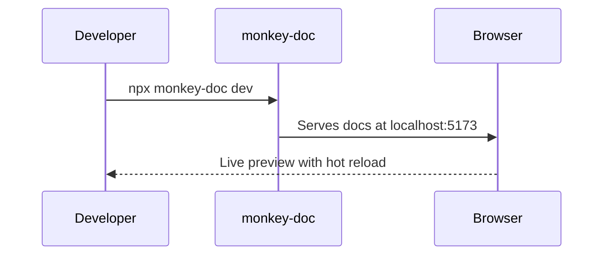

# Components

Monkey-Doc ships with a set of built-in MDX components you can use anywhere.

## Callout

Highlight important information.

<Callout type="info">This is an **info** callout.</Callout>

<Callout type="warning">This is a **warning** callout.</Callout>

<Callout type="success">This is a **success** callout.</Callout>

```mdx
<Callout type="info">Your message here.</Callout>
```

## Steps

Walk users through a sequence.

<Steps>
  <Step title="First step">Do this first.</Step>
  <Step title="Second step">Then do this.</Step>
  <Step title="Third step">Finally, do this.</Step>
</Steps>

```mdx
<Steps>
  <Step title="First step">Do this first.</Step>
  <Step title="Second step">Then do this.</Step>
</Steps>
```

## Card

Group related content visually.

<Card title="Quick tip" description="Cards are great for feature highlights or link grids." />

```mdx
<Card title="Quick tip" description="Your description here." />
```

## Tabs

Display content in tabbed panels.

<Tabs labels={["npm", "yarn", "pnpm"]}>
  <div><code>npm install monkey-doc</code></div>
  <div><code>yarn add monkey-doc</code></div>
  <div><code>pnpm add monkey-doc</code></div>
</Tabs>

```mdx
<Tabs labels={["npm", "yarn", "pnpm"]}>
  <div>npm install monkey-doc</div>
  <div>yarn add monkey-doc</div>
  <div>pnpm add monkey-doc</div>
</Tabs>
```

## FileTree

Visualize a folder structure.

<FileTree>
  <Folder name="docs">
    <File name="getting-started.mdx" highlight />
    <Folder name="guides">
      <File name="writing-guides.mdx" />
      <File name="best-practices.mdx" />
    </Folder>
    <File name="components.mdx" />
  </Folder>
</FileTree>

Use the `highlight` prop on a `<File>` to draw attention to a specific file.

```mdx
<FileTree>
  <Folder name="docs">
    <File name="getting-started.mdx" highlight />
    <Folder name="guides">
      <File name="writing-guides.mdx" />
    </Folder>
  </Folder>
</FileTree>
```

## CodeGroup

Show multiple code snippets in tabs — ideal for package manager commands or multi-language examples.

<CodeGroup labels={["npm", "yarn", "pnpm"]}>

```bash
npm install monkey-doc
```

```bash
yarn add monkey-doc
```

```bash
pnpm add monkey-doc
```

</CodeGroup>

## Accordion

Collapsible sections, great for FAQs or optional details.

<Accordion title="What is Monkey-Doc?">
  Monkey-Doc is a documentation tool focused on product guides and storytelling, as an alternative to Storybook.
</Accordion>

<Accordion title="Do I need to configure anything?">
  No — run `npx monkey-doc init` and you're ready to go. Zero configuration required.
</Accordion>

<Accordion title="Can I nest folders?" defaultOpen>
  Yes, folders can be nested as deeply as needed. The sidebar is generated automatically from your file structure.
</Accordion>

```mdx
<Accordion title="Your question here">
  Your answer here.
</Accordion>

<Accordion title="Open by default" defaultOpen>
  This one starts expanded.
</Accordion>
```

## Badge

Inline labels for status, versioning, or categorization.

<div className="flex flex-wrap gap-2 my-4">
  <Badge>Default</Badge>
  <Badge variant="info">Info</Badge>
  <Badge variant="success">Success</Badge>
  <Badge variant="warning">Warning</Badge>
  <Badge variant="error">Error</Badge>
  <Badge variant="new">New</Badge>
  <Badge variant="beta">Beta</Badge>
  <Badge variant="deprecated">Deprecated</Badge>
</div>

Use badges inline in prose too — for example, this feature is <Badge variant="new">New</Badge> in v2.

```mdx
<Badge variant="new">New</Badge>
<Badge variant="beta">Beta</Badge>
<Badge variant="deprecated">Deprecated</Badge>
```

Available variants: `default` · `info` · `success` · `warning` · `error` · `new` · `beta` · `deprecated`

## Mermaid

Render diagrams from [Mermaid](https://mermaid.js.org) syntax.





## Property

Document a prop, parameter, or configuration option with its type, default value, and description.

<PropertyGroup title="Props">
  <Property name="title" type="string" required>
    The title of the page or section.
  </Property>
  <Property name="order" type="number" defaultValue="999">
    Controls the position of the page in the sidebar. Lower values appear first.
  </Property>
  <Property name="description" type="string">
    A short description shown in search results and meta tags.
  </Property>
  <Property name="theme" type='"light" | "dark" | "auto"' defaultValue='"auto"'>
    Sets the color theme for the documentation site.
  </Property>
  <Property name="legacyProp" type="boolean" deprecated>
    This prop is no longer used. Remove it from your config.
  </Property>
</PropertyGroup>

```mdx
<PropertyGroup title="Props">
  <Property name="title" type="string" required>
    The title of the page.
  </Property>
  <Property name="order" type="number" defaultValue="999">
    Position in the sidebar.
  </Property>
</PropertyGroup>
```

## Video

Embed a video from a URL or a YouTube / Vimeo link.

```mdx
<Video src="/demo.mp4" caption="Feature walkthrough" />

<Video
  src="https://www.youtube.com/watch?v=VIDEO_ID"
  poster="https://img.youtube.com/vi/VIDEO_ID/maxresdefault.jpg"
  title="Demo"
  caption="Optional caption"
/>
```

## Breadcrumb

An inline breadcrumb trail for content pages.

<Breadcrumb items={["Docs", "Components", "Breadcrumb"]} />

```mdx
<Breadcrumb items={["Docs", "Components", "Breadcrumb"]} />
<Breadcrumb items={[{ label: "Docs", href: "/" }, "Components"]} />
```

## Diff

Show a before/after code diff with green/red line highlighting.

<Diff
  before="const greeting = 'Hello'"
  after="const greeting = 'Hello, World!'"
  language="js"
/>

```mdx
<Diff
  before="const message = 'Hello World'"
  after="const message = 'Hello, Universe!'"
  language="js"
/>
```

## Stepper

An interactive checklist-style stepper. Click a step to mark it complete.

<Stepper>
  <StepperStep title="Clone the repository">
    Run `git clone https://github.com/your-org/your-project.git` to get a local copy.
  </StepperStep>
  <StepperStep title="Install dependencies">
    Navigate into the project folder and run `npm install`.
  </StepperStep>
  <StepperStep title="Start the dev server">
    Run `npm run dev` and open `http://localhost:5173` in your browser.
  </StepperStep>
</Stepper>

```mdx
<Stepper>
  <StepperStep title="Clone the repository">
    Run `git clone ...`
  </StepperStep>
  <StepperStep title="Install dependencies">
    Run `npm install`.
  </StepperStep>
</Stepper>
```

## LinkButton

A styled link that looks like a button. Three variants and three sizes — works great for CTAs, download links, or navigation.

<div className="flex flex-wrap gap-3 my-4">
  <LinkButton href="/en/getting-started">Get started</LinkButton>
  <LinkButton href="/en/getting-started" variant="outline">Read the docs</LinkButton>
  <LinkButton href="/en/getting-started" variant="ghost">Learn more</LinkButton>
</div>

External links automatically get a `↗` icon and open in a new tab:

<LinkButton href="https://github.com/armanceau/monkey-doc">View on GitHub</LinkButton>

```mdx
<LinkButton href="/installation">Get started</LinkButton>
<LinkButton href="/guide" variant="outline" size="sm">Read more</LinkButton>
<LinkButton href="https://github.com" variant="ghost">GitHub ↗</LinkButton>
```

Props: `href` · `variant` (`default` / `outline` / `ghost`) · `size` (`sm` / `md` / `lg`) · `external` (auto-detected from URL)

## Charts

Three chart types powered by Chart.js. All adapt to dark mode automatically.

### BarChart

<BarChart
  labels={["Jan", "Feb", "Mar", "Apr", "May", "Jun"]}
  datasets={[
    { label: "Page views", data: [4200, 5800, 4900, 7100, 6300, 8400] },
    { label: "Unique visitors", data: [2100, 3200, 2700, 4100, 3500, 4900] }
  ]}
  title="Monthly traffic"
/>

```mdx
<BarChart
  labels={["Jan", "Feb", "Mar"]}
  datasets={[{ label: "Views", data: [4200, 5800, 4900] }]}
  title="Monthly traffic"
/>
```

Add `horizontal` for a horizontal layout. Use `height` to adjust the chart height (default `280`).

### DonutChart

<DonutChart
  labels={["Vercel", "Netlify", "GitHub Pages", "Cloudflare"]}
  data={[48, 27, 15, 10]}
  title="Deploy platform distribution"
/>

```mdx
<DonutChart
  labels={["Vercel", "Netlify", "GitHub Pages"]}
  data={[48, 27, 25]}
  title="Deploy platforms"
/>
```

### RadarChart

<RadarChart
  labels={["Performance", "SEO", "Accessibility", "Best Practices", "PWA"]}
  datasets={[
    { label: "v1.0", data: [72, 85, 78, 80, 55] },
    { label: "v2.0", data: [95, 92, 97, 91, 78] }
  ]}
  title="Lighthouse scores"
/>

```mdx
<RadarChart
  labels={["Performance", "SEO", "Accessibility"]}
  datasets={[
    { label: "v1", data: [72, 85, 78] },
    { label: "v2", data: [95, 92, 97] }
  ]}
  title="Scores"
/>
```
