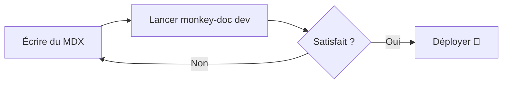

# Composants

Monkey-Doc est livré avec un ensemble de composants MDX intégrés utilisables partout.

## Callout

Mettez en évidence des informations importantes.

<Callout type="info">Ceci est un callout **info**.</Callout>

<Callout type="warning">Ceci est un callout **avertissement**.</Callout>

<Callout type="success">Ceci est un callout **succès**.</Callout>

```mdx
<Callout type="info">Votre message ici.</Callout>
```

## Steps

Guidez les utilisateurs à travers une séquence.

<Steps>
  <Step title="Première étape">Faites ceci en premier.</Step>
  <Step title="Deuxième étape">Puis faites cela.</Step>
  <Step title="Troisième étape">Enfin, faites ceci.</Step>
</Steps>

```mdx
<Steps>
  <Step title="Première étape">Faites ceci en premier.</Step>
  <Step title="Deuxième étape">Puis faites cela.</Step>
</Steps>
```

## Card

Regroupez visuellement du contenu lié.

<Card title="Conseil rapide" description="Les cartes sont idéales pour mettre en avant des fonctionnalités ou créer des grilles de liens." />

```mdx
<Card title="Conseil rapide" description="Votre description ici." />
```

## Tabs

Affichez du contenu dans des panneaux à onglets.

<Tabs labels={["npm", "yarn", "pnpm"]}>
  <div><code>npm install monkey-doc</code></div>
  <div><code>yarn add monkey-doc</code></div>
  <div><code>pnpm add monkey-doc</code></div>
</Tabs>

```mdx
<Tabs labels={["npm", "yarn", "pnpm"]}>
  <div>npm install monkey-doc</div>
  <div>yarn add monkey-doc</div>
  <div>pnpm add monkey-doc</div>
</Tabs>
```

## FileTree

Visualisez une structure de dossiers.

<FileTree>
  <Folder name="docs">
    <File name="getting-started.mdx" highlight />
    <Folder name="guides">
      <File name="writing-guides.mdx" />
      <File name="best-practices.mdx" />
    </Folder>
    <File name="components.mdx" />
  </Folder>
</FileTree>

Utilisez la prop `highlight` sur un `<File>` pour attirer l'attention sur un fichier spécifique.

```mdx
<FileTree>
  <Folder name="docs">
    <File name="getting-started.mdx" highlight />
  </Folder>
</FileTree>
```

## CodeGroup

Affichez plusieurs extraits de code dans des onglets.

<CodeGroup labels={["npm", "yarn", "pnpm"]}>

```bash
npm install monkey-doc
```

```bash
yarn add monkey-doc
```

```bash
pnpm add monkey-doc
```

</CodeGroup>

## Accordion

Sections repliables, idéales pour les FAQ ou les détails optionnels.

<Accordion title="Qu'est-ce que Monkey-Doc ?">
  Monkey-Doc est un outil de documentation orienté guides produit et storytelling, en alternative à Storybook.
</Accordion>

<Accordion title="Faut-il configurer quelque chose ?">
  Non — lancez `npx monkey-doc init` et c'est prêt. Zéro configuration requise.
</Accordion>

<Accordion title="Peut-on imbriquer des dossiers ?" defaultOpen>
  Oui, les dossiers peuvent être imbriqués aussi profondément que nécessaire.
</Accordion>

```mdx
<Accordion title="Votre question ici">
  Votre réponse ici.
</Accordion>
```

## Badge

Étiquettes inline pour le statut, le versioning ou la catégorisation.

<div className="flex flex-wrap gap-2 my-4">
  <Badge>Default</Badge>
  <Badge variant="info">Info</Badge>
  <Badge variant="success">Succès</Badge>
  <Badge variant="warning">Attention</Badge>
  <Badge variant="error">Erreur</Badge>
  <Badge variant="new">Nouveau</Badge>
  <Badge variant="beta">Beta</Badge>
  <Badge variant="deprecated">Déprécié</Badge>
</div>

```mdx
<Badge variant="new">Nouveau</Badge>
<Badge variant="beta">Beta</Badge>
<Badge variant="deprecated">Déprécié</Badge>
```

Variantes disponibles : `default` · `info` · `success` · `warning` · `error` · `new` · `beta` · `deprecated`

## Mermaid

Rendu de diagrammes depuis la syntaxe [Mermaid](https://mermaid.js.org).



## Property

Documentez une prop, un paramètre ou une option de configuration.

<PropertyGroup title="Props">
  <Property name="title" type="string" required>
    Le titre de la page ou de la section.
  </Property>
  <Property name="order" type="number" defaultValue="999">
    Contrôle la position de la page dans la sidebar.
  </Property>
  <Property name="theme" type='"light" | "dark" | "auto"' defaultValue='"auto"'>
    Définit le thème de couleur du site de documentation.
  </Property>
  <Property name="ancienneProp" type="boolean" deprecated>
    Cette prop n'est plus utilisée. Retirez-la de votre config.
  </Property>
</PropertyGroup>

```mdx
<PropertyGroup title="Props">
  <Property name="title" type="string" required>
    Le titre de la page.
  </Property>
</PropertyGroup>
```

## Video

Intégrez une vidéo depuis une URL ou un lien YouTube / Vimeo.

```mdx
<Video src="/demo.mp4" caption="Présentation de la fonctionnalité" />

<Video
  src="https://www.youtube.com/watch?v=VIDEO_ID"
  poster="https://img.youtube.com/vi/VIDEO_ID/maxresdefault.jpg"
  title="Démo"
  caption="Légende optionnelle"
/>
```

## Breadcrumb

Un fil d'Ariane embarqué dans le contenu.

<Breadcrumb items={["Docs", "Composants", "Breadcrumb"]} />

```mdx
<Breadcrumb items={["Docs", "Composants", "Breadcrumb"]} />
<Breadcrumb items={[{ label: "Docs", href: "/" }, "Composants"]} />
```

## Diff

Affiche un diff avant/après avec highlighting vert/rouge.

<Diff
  before="const greeting = 'Bonjour'"
  after="const greeting = 'Bonjour le monde !'"
  language="js"
/>

```mdx
<Diff
  before="const message = 'Bonjour monde'"
  after="const message = 'Bonjour l\'univers !'"
  language="js"
/>
```

## Stepper

Un stepper interactif de type checklist.

<Stepper>
  <StepperStep title="Cloner le dépôt">
    Lancez `git clone https://github.com/votre-org/votre-projet.git`.
  </StepperStep>
  <StepperStep title="Installer les dépendances">
    Naviguez dans le dossier du projet et lancez `npm install`.
  </StepperStep>
  <StepperStep title="Démarrer le serveur de développement">
    Lancez `npm run dev` et ouvrez `http://localhost:5173`.
  </StepperStep>
</Stepper>

```mdx
<Stepper>
  <StepperStep title="Cloner le dépôt">
    Lancez `git clone ...`
  </StepperStep>
</Stepper>
```

## LinkButton

Un lien stylisé en bouton. Trois variantes et trois tailles.

<div className="flex flex-wrap gap-3 my-4">
  <LinkButton href="/fr/getting-started">Commencer</LinkButton>
  <LinkButton href="/fr/getting-started" variant="outline">Lire la doc</LinkButton>
  <LinkButton href="/fr/getting-started" variant="ghost">En savoir plus</LinkButton>
</div>

Les liens externes reçoivent automatiquement une icône `↗` et s'ouvrent dans un nouvel onglet :

<LinkButton href="https://github.com/armanceau/monkey-doc">Voir sur GitHub</LinkButton>

```mdx
<LinkButton href="/installation">Commencer</LinkButton>
<LinkButton href="/guide" variant="outline" size="sm">Lire la suite</LinkButton>
<LinkButton href="https://github.com" variant="ghost">GitHub ↗</LinkButton>
```

Props : `href` · `variant` (`default` / `outline` / `ghost`) · `size` (`sm` / `md` / `lg`) · `external` (détecté automatiquement)

## Graphiques

Trois types de graphiques propulsés par Chart.js. Tous s'adaptent automatiquement au dark mode.

### BarChart

<BarChart
  labels={["Jan", "Fév", "Mar", "Avr", "Mai", "Juin"]}
  datasets={[
    { label: "Pages vues", data: [4200, 5800, 4900, 7100, 6300, 8400] },
    { label: "Visiteurs uniques", data: [2100, 3200, 2700, 4100, 3500, 4900] }
  ]}
  title="Trafic mensuel"
/>

```mdx
<BarChart
  labels={["Jan", "Fév", "Mar"]}
  datasets={[{ label: "Vues", data: [4200, 5800, 4900] }]}
  title="Trafic mensuel"
/>
```

### DonutChart

<DonutChart
  labels={["Vercel", "Netlify", "GitHub Pages", "Cloudflare"]}
  data={[48, 27, 15, 10]}
  title="Répartition des plateformes de déploiement"
/>

```mdx
<DonutChart
  labels={["Vercel", "Netlify", "GitHub Pages"]}
  data={[48, 27, 25]}
  title="Plateformes de déploiement"
/>
```

### RadarChart

<RadarChart
  labels={["Performance", "SEO", "Accessibilité", "Bonnes pratiques", "PWA"]}
  datasets={[
    { label: "v1.0", data: [72, 85, 78, 80, 55] },
    { label: "v2.0", data: [95, 92, 97, 91, 78] }
  ]}
  title="Scores Lighthouse"
/>

```mdx
<RadarChart
  labels={["Performance", "SEO", "Accessibilité"]}
  datasets={[
    { label: "v1", data: [72, 85, 78] },
    { label: "v2", data: [95, 92, 97] }
  ]}
  title="Scores"
/>
```
